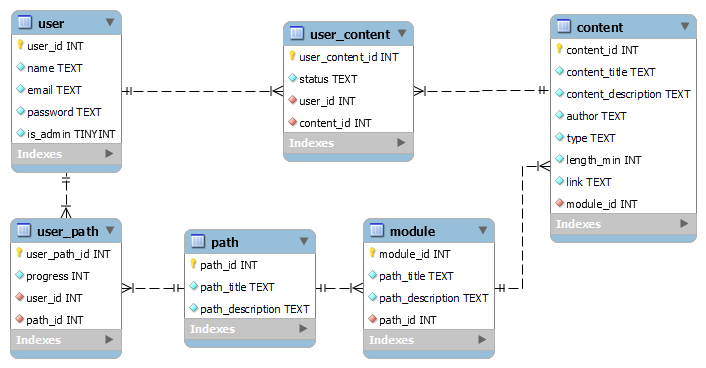

# Backend

## Banco de Dados 🎲

### Modelagem

Escolhemos o <a href="https://www.sqlite.org/quickstart.html" target="_blank">SQLite</a> como o banco de dados do projeto por ser leve e ágil para implementar.

<figure>
  
  <figcaption>Diagrama de entidades e relacionamentos do banco de dados.</figcaption>
</figure>

---

### Implementação

Para criar e testar as tabelas utilizamos as seguintes queries:

#### <strong>- Tabela "user"</strong>

Código de criação da tabela user, que recebe os dados dos usuários da plataforma:

<pre>
CREATE TABLE IF NOT EXISTS user (
user_id INTEGER NOT NULL PRIMARY KEY,
name TEXT NOT NULL,
email TEXT NOT NULL,
password TEXT NOT NULL,
is_admin INTEGER NOT NULL
);
</pre>

Exemplos de inserts:

<pre>
INSERT INTO user (name, email, password, is_admin) VALUES ("", "", "", 0); // insert sem valores

INSERT INTO user (name, email, password, is_admin) VALUES ("Arthur", "arthur@arthur.com", "123456", 0);
INSERT INTO user (name, email, password, is_admin) VALUES ("Rosana", "rosana@rosana.com", "123456", 0);
INSERT INTO user (name, email, password, is_admin) VALUES ("Lucyan", "lucyan@lucyan.com", "123456", 0);
INSERT INTO user (name, email, password, is_admin) VALUES ("Juliana", "juliana@juliana.com", "123456", 0);
</pre>

---

#### <strong>Tabela "path"</strong>

Código de criação da tabela path, que recebe os dados das trilhas da plataforma:

<pre>
CREATE TABLE IF NOT EXISTS path (
path_id INTEGER NOT NULL PRIMARY KEY,
path_title TEXT NOT NULL,
path_description TEXT NOT NULL
);
</pre>

Exemplos de inserts:

<pre>
INSERT INTO path (path_title, path_description) VALUES ("", ""); // insert sem valores

INSERT INTO path (path_title, path_description) VALUES ("UX/UI", "Tudo sobre UX/UI");
INSERT INTO path (path_title, path_description) VALUES ("QA", "Tudo sobre QA");
INSERT INTO path (path_title, path_description) VALUES ("Fullstack", "Tudo sobre Fullstack");
</pre>

---

#### <strong>Tabela "module"</strong>

Código de criação da tabela module, que recebe os dados dos módulos das trilhas:

<pre>
CREATE TABLE IF NOT EXISTS module (
module_id INTEGER NOT NULL PRIMARY KEY,
module_title TEXT NOT NULL,
module_description TEXT NOT NULL,
module_path_id INTEGER NOT NULL,
FOREIGN KEY(module_path_id) REFERENCES path(path_id)
);
</pre>

Exemplos de inserts:

<pre>
INSERT INTO module (module_title, module_description, module_path_id) VALUES ("", "", 1); // insert sem valores

INSERT INTO module (module_title, module_description, module_path_id) VALUES ("O Início", "Comece seu caminho por aqui", 1);
INSERT INTO module (module_title, module_description, module_path_id) VALUES ("Fundamentos de UX(User Experience)", "O básico do UX", 1);
INSERT INTO module (module_title, module_description, module_path_id) VALUES ("Fundamentos de UI", "O básico de UI", 1);
</pre>

---

#### <strong>Tabela "content"</strong>

Código de criação da tabela content, que recebe os dados dos conteúdos da plataforma:

<pre>
CREATE TABLE IF NOT EXISTS content (
content_id INTEGER NOT NULL PRIMARY KEY,
content_title TEXT NOT NULL,
content_description TEXT NOT NULL,
author TEXT NOT NULL,
type TEXT NOT NULL,
length_min INTEGER NOT NULL,
link TEXT NOT NULL,
content_module_id INTEGER NOT NULL,
FOREIGN KEY(content_module_id) REFERENCES module(module_id)
);
</pre>

Exemplos de inserts:

<pre>
INSERT INTO content (content_title, content_description, author, type, length_min, link, content_module_id) VALUES ("","","","",1,"",1); // insert sem valores

INSERT INTO content (content_title, content_description, author, type, length_min, link, content_module_id) VALUES ("Migração de Carreira","Como funciona migração de carreira?","Orange Juice","Artigo",6,"https://medium.com/orangejuicefc/guia-definitivo-de-como-migrar-para-ux-design-5-passos-para-virar-um-ux-1675f71796b4",1);
</pre>

---

#### <strong>Tabela "user_path"</strong>

Código de criação da tabela user_path, que recebe os dados do relacionamento do usuário com a trilha:

<pre>
CREATE TABLE IF NOT EXISTS user_path (
user_path_id INTEGER NOT NULL PRIMARY KEY,
user_path_user_id INTEGER NOT NULL,
user_path_path_id INTEGER NOT NULL,
progress INTEGER NOT NULL,
FOREIGN KEY(user_path_user_id) REFERENCES user(user_id),
FOREIGN KEY(user_path_path_id) REFERENCES path(path_id)
);
</pre>

Exemplos de inserts:

<pre>
INSERT INTO user_path (user_path_user_id, user_path_path_id, progress) VALUES (1,1,1);
</pre>

---

#### <strong>-Tabela "user_content"</strong>

Código de criação da tabela user_content, que recebe os dados do relacionamento do usuário com o conteúdo:

<pre>
CREATE TABLE IF NOT EXISTS user_content (
user_content_id INTEGER NOT NULL PRIMARY KEY,
user_content_user_id INTEGER NOT NULL,
user_content_content_id INTEGER NOT NULL,
status TEXT NOT NULL,
FOREIGN KEY(user_content_user_id) REFERENCES user(user_id),
FOREIGN KEY(user_content_content_id) REFERENCES content(content_id)
);
</pre>

Exemplos de inserts:

<pre>
INSERT INTO user_content (user_content_user_id, user_content_content_id, status) VALUES (1,1,""); // insert sem valores

INSERT INTO user_content (user_content_user_id, user_content_content_id, status) VALUES (1,1,"Concluído");
</pre>
